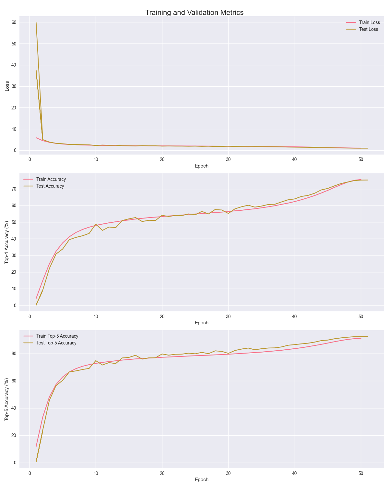
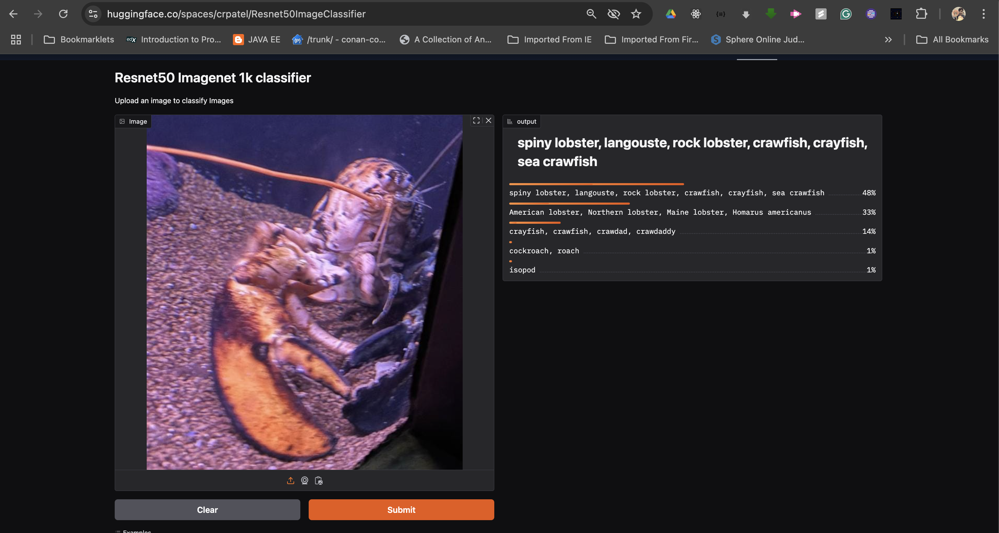
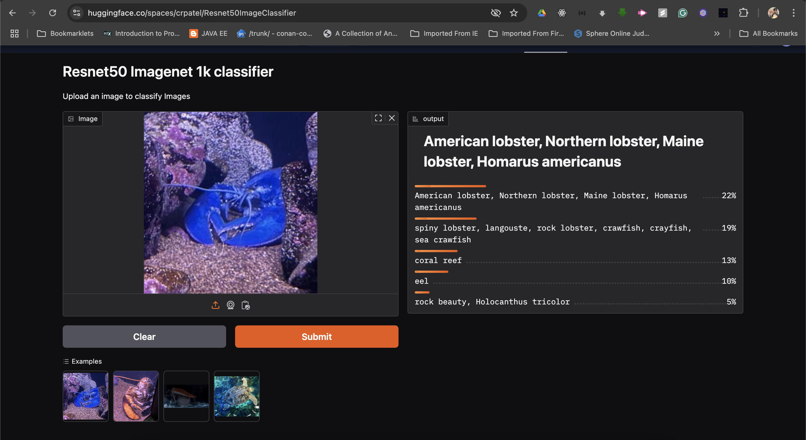
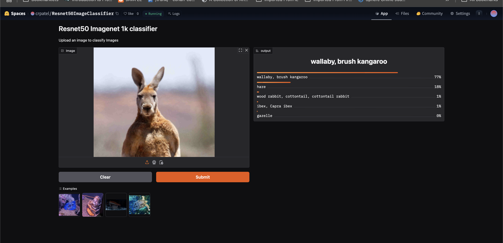
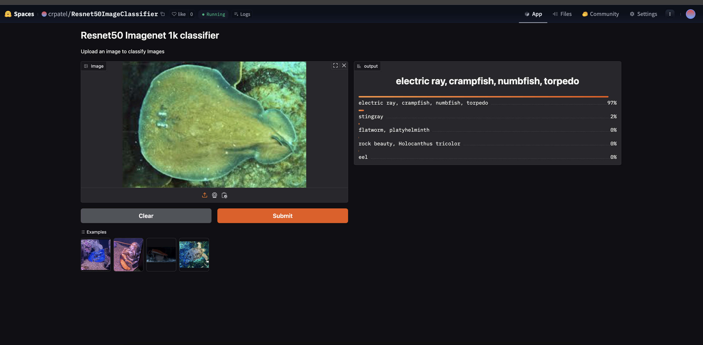
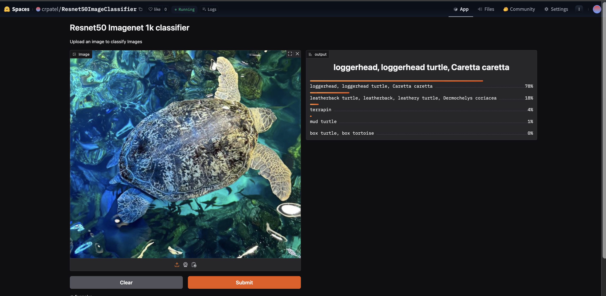

# Resnet50-Imagenet1K Training from scratch on AWS

- This is attempt to train Resnet50 Model from scratch using Resnet 50 Model  on Imagenet 1000 classes
- Imagenet 1000 classes is a dataset of 1.2 million train images with 1000 classes, 50000 validation images with 1000 classes and 100000 test images with 1000 classes. Dataset total size is around 160 GB.
- The dataset is available on [Imagenet](https://www.image-net.org/index.php)
- Dataset is also available on [Kaggle](https://www.kaggle.com/c/imagenet-object-localization-challenge/data)
- I used kaggle dataset for this project.

## Infrastructure set up

I used AWS EC2 instance for this project.
- Instance type: g5.8xlarge (1 GPU 24 GB RAM, 32 vCPUs, 128 GB CPU RAM, 1 * NVIDIA A10G Tensor Core GPUs)
- Storage volume: 390 GB EBS storage
- Cost of Final Training: $26.41 ( Total 27 hours of Spot instance training)
- Spot instance cost: $0.97 per hour
- Training time: 27 hours (35 minutes per epoch, trained for 50 epochs)

### Creating a Volume for Training
```bash
# 1. First launch small t3.xlarge instance

# Create a 390GB gp3 volume in the same AZ as your instance (us-east-1a)
aws ec2 create-volume \
    --volume-type gp3 \
    --size 390 \
    --availability-zone us-east-1a \
    --tag-specifications 'ResourceType=volume,Tags=[{Key=Name,Value=ImageNet-Data}]'
# Note the VolumeId from output
# 2. Attach the volume to the instance
aws ec2 attach-volume \
    --volume-id vol-xxxx \
    --instance-id i-xxxx \
    --device /dev/sdf

# 3. Create filesystem
# (sudo mkfs -t ext4 /dev/xvdf)
sudo mkfs -t ext4 /dev/nvme1n1 
# 4. Create mount point and mount
sudo mkdir -p /mnt/data
sudo mount /dev/nvme1n1  /mnt/data

sudo chown -R ubuntu:ubuntu /mnt/data

# 5. Download dataset from kaggle
## 5.1 set up kaggle see [kaggle-setup](https://www.kaggle.com/docs/api)
cd /mnt/data
kaggle datasets download -d tusonggao/imagenet-train-subset-100k -p /mnt/data
unzip imagenet-train-subset-100k.zip

# 6. Download validation dataset from kaggle

#!/bin/bash
kaggle datasets download chiragtagadiya/val-imagenet-1000
unzip val-imagenet-1000.zip

# 7. Create snapshot of the volume
aws ec2 create-snapshot \
    --volume-id vol-xxxxxx \
    --description "ImageNet Dataset" \
    --tag-specifications 'ResourceType=snapshot,Tags=[{Key=Name,Value=ImageNet-Snapshot}]'

## note down the snapshot id
# 8. Create a new volume from snapshot
aws ec2 create-volume \
    --volume-type gp3 \
    --snapshot-id snap-xxxxxx \
    --availability-zone us-east-1a \
    --tag-specifications 'ResourceType=volume,Tags=[{Key=Name,Value=ImageNet-Data}]'

# delete the old volume
aws ec2 delete-volume --volume-id vol-xxxxxx --region us-east-1
# stop and terminate the instance
aws ec2 stop-instances --instance-ids i-xxxxxx --region us-east-1
aws ec2 terminate-instances --instance-ids i-xxxxxx --region us-east-1

## few of this commands can be executed from aws console ui
```
### Training

```bash

## now launch a new instance from aws console ui g5.8xlarge Deep Learning AMI Ubuntu create persistent spot instance
# note down instance id
# attach the volume to the instance
# g5.8xlarge instance type has 1 GPU 24 GB RAM, 32 vCPUs, 128 GB CPU RAM, 1 * NVIDIA A10G Tensor Core GPUs
aws ec2 attach-volume \
    --volume-id $VOLUME_ID \
    --instance-id $INSTANCE_ID \
    --device /dev/xvdf
# ssh into the instance
DEVICE_NAME=$(lsblk -o NAME,MOUNTPOINT | grep -v 'MOUNTPOINT' | grep -E 'nvme|xvd' | awk '{print "/dev/"$1}' | tail -n1)

sudo mkdir -p /mnt/data
sudo mount $DEVICE_NAME /mnt/data
sudo chown -R ubuntu:ubuntu /mnt/data
# mount the volume to the instance
# run the training script   
conda init
conda activate pytorch
tmux new -t train
pip install nvitop # gpu monitoring tool
nohup python3 trainer.py > train.log 2>&1 &
# monitor training progress
tail -f train.log

```

## Training strategy
- Basic Data Augmentation
- Mixed Precision Training (FP16)
- Learning Rate found using LR Finder
- One Cycle Learning Rate Policy


## Training Results



1. Training progress

    | Epoch | Loss | Accuracy (%) | Top-5 Accuracy (%) | Learning Rate |
    |-------|------|-------------|-------------------|----------------|
    | 1 | 5.88 | 3.94 | 11.55 | 0.00884 |
    | 5 | 2.91 | 37.51 | 62.82 | 0.04900 |
    | 10 | 2.33 | 48.03 | 72.79 | 0.13300 |
    | 15 | 2.15 | 51.32 | 75.63 | 0.17500 |
    | 20 | 2.05 | 53.34 | 77.26 | 0.16633 |
    | 25 | 1.97 | 54.91 | 78.41 | 0.14205 |
    | 30 | 1.90 | 56.40 | 79.51 | 0.10697 |
    | 35 | 1.79 | 58.61 | 81.06 | 0.06803 |
    | 40 | 1.60 | 62.35 | 83.60 | 0.03294 |
    | 45 | 1.29 | 69.10 | 87.69 | 0.00866 |
    | 48 | 1.07 | 74.09 | 90.36 | 0.00141 |
    | 50 | 1.00 | 75.65 | 91.12 | 0.0000007 |

2. Test progress


    | Epoch | Loss | Accuracy (%) | Top-5 Accuracy (%) |
    |-------|------|-------------|-------------------|
    | 1 | 59.80 | 0.10 | 0.50 |
    | 5 | 3.05 | 33.81 | 60.30 |
    | 10 | 2.22 | 48.82 | 74.79 |
    | 15 | 2.07 | 51.98 | 77.18 |
    | 20 | 1.93 | 54.10 | 79.69 |
    | 25 | 1.93 | 54.42 | 79.80 |
    | 30 | 1.89 | 55.23 | 80.12 |
    | 35 | 1.67 | 59.65 | 83.54 |
    | 40 | 1.45 | 63.96 | 86.56 |
    | 45 | 1.19 | 70.27 | 89.88 |
    | 48 | 1.02 | 74.11 | 91.99 |
    | 50 | 0.97 | 75.29 | 92.56 |
    | 51 | 0.97 | 75.32 | 92.59 |


## Training Progress

Key metrics across epochs:

### Early Training (Epoch 1-5)
- Epoch 1: Train Acc: 3.94%, Test Acc: 0.1%, Top-5 Train: 11.55%, Top-5 Test: 0.5%
- Epoch 5: Train Acc: 37.51%, Test Acc: 33.81%, Top-5 Train: 62.82%, Top-5 Test: 60.30%

### Mid Training (Epoch 20-25)
- Epoch 20: Train Acc: 53.34%, Test Acc: 54.10%, Top-5 Train: 77.26%, Top-5 Test: 79.69%
- Epoch 25: Train Acc: 54.91%, Test Acc: 54.42%, Top-5 Train: 78.41%, Top-5 Test: 79.80%

### Final Training (Epoch 45-50)
- Epoch 45: Train Acc: 69.10%, Test Acc: 70.27%, Top-5 Train: 87.69%, Top-5 Test: 89.88%
- Epoch 48: Train Acc: 74.09%, Test Acc: 74.11%, Top-5 Train: 90.36%, Top-5 Test: 91.99%
- Epoch 50: Train Acc: 75.65%, Test Acc: 75.29%, Top-5 Train: 91.12%, Top-5 Test: 92.56%

### Training Observations
- Model showed steady improvement in both training and test accuracy
- Final top-1 test accuracy: 75.29%
- Final top-5 test accuracy: 92.56%
- Training loss decreased from 5.88 to 1.00 across epochs
- Learning rate was adjusted using one cycle policy from 0.0088357 to 0.0000007 across 50 epochs

## Model Architecture
```
----------------------------------------------------------------
        Layer (type)               Output Shape         Param #
================================================================
            Conv2d-1         [-1, 64, 112, 112]           9,408
       BatchNorm2d-2         [-1, 64, 112, 112]             128
              ReLU-3         [-1, 64, 112, 112]               0
         MaxPool2d-4           [-1, 64, 56, 56]               0
            Conv2d-5           [-1, 64, 56, 56]           4,096
       BatchNorm2d-6           [-1, 64, 56, 56]             128
              ReLU-7           [-1, 64, 56, 56]               0
            Conv2d-8           [-1, 64, 56, 56]          36,864
       BatchNorm2d-9           [-1, 64, 56, 56]             128
             ReLU-10           [-1, 64, 56, 56]               0
           Conv2d-11          [-1, 256, 56, 56]          16,384
      BatchNorm2d-12          [-1, 256, 56, 56]             512
           Conv2d-13          [-1, 256, 56, 56]          16,384
      BatchNorm2d-14          [-1, 256, 56, 56]             512
             ReLU-15          [-1, 256, 56, 56]               0
       Bottleneck-16          [-1, 256, 56, 56]               0
           Conv2d-17           [-1, 64, 56, 56]          16,384
      BatchNorm2d-18           [-1, 64, 56, 56]             128
             ReLU-19           [-1, 64, 56, 56]               0
           Conv2d-20           [-1, 64, 56, 56]          36,864
      BatchNorm2d-21           [-1, 64, 56, 56]             128
             ReLU-22           [-1, 64, 56, 56]               0
           Conv2d-23          [-1, 256, 56, 56]          16,384
      BatchNorm2d-24          [-1, 256, 56, 56]             512
             ReLU-25          [-1, 256, 56, 56]               0
       Bottleneck-26          [-1, 256, 56, 56]               0
           Conv2d-27           [-1, 64, 56, 56]          16,384
      BatchNorm2d-28           [-1, 64, 56, 56]             128
             ReLU-29           [-1, 64, 56, 56]               0
           Conv2d-30           [-1, 64, 56, 56]          36,864
      BatchNorm2d-31           [-1, 64, 56, 56]             128
             ReLU-32           [-1, 64, 56, 56]               0
           Conv2d-33          [-1, 256, 56, 56]          16,384
      BatchNorm2d-34          [-1, 256, 56, 56]             512
             ReLU-35          [-1, 256, 56, 56]               0
       Bottleneck-36          [-1, 256, 56, 56]               0
           Conv2d-37          [-1, 128, 56, 56]          32,768
      BatchNorm2d-38          [-1, 128, 56, 56]             256
             ReLU-39          [-1, 128, 56, 56]               0
           Conv2d-40          [-1, 128, 28, 28]         147,456
      BatchNorm2d-41          [-1, 128, 28, 28]             256
             ReLU-42          [-1, 128, 28, 28]               0
           Conv2d-43          [-1, 512, 28, 28]          65,536
      BatchNorm2d-44          [-1, 512, 28, 28]           1,024
           Conv2d-45          [-1, 512, 28, 28]         131,072
      BatchNorm2d-46          [-1, 512, 28, 28]           1,024
             ReLU-47          [-1, 512, 28, 28]               0
       Bottleneck-48          [-1, 512, 28, 28]               0
           Conv2d-49          [-1, 128, 28, 28]          65,536
      BatchNorm2d-50          [-1, 128, 28, 28]             256
             ReLU-51          [-1, 128, 28, 28]               0
           Conv2d-52          [-1, 128, 28, 28]         147,456
      BatchNorm2d-53          [-1, 128, 28, 28]             256
             ReLU-54          [-1, 128, 28, 28]               0
           Conv2d-55          [-1, 512, 28, 28]          65,536
      BatchNorm2d-56          [-1, 512, 28, 28]           1,024
             ReLU-57          [-1, 512, 28, 28]               0
       Bottleneck-58          [-1, 512, 28, 28]               0
           Conv2d-59          [-1, 128, 28, 28]          65,536
      BatchNorm2d-60          [-1, 128, 28, 28]             256
             ReLU-61          [-1, 128, 28, 28]               0
           Conv2d-62          [-1, 128, 28, 28]         147,456
      BatchNorm2d-63          [-1, 128, 28, 28]             256
             ReLU-64          [-1, 128, 28, 28]               0
           Conv2d-65          [-1, 512, 28, 28]          65,536
      BatchNorm2d-66          [-1, 512, 28, 28]           1,024
             ReLU-67          [-1, 512, 28, 28]               0
       Bottleneck-68          [-1, 512, 28, 28]               0
           Conv2d-69          [-1, 128, 28, 28]          65,536
      BatchNorm2d-70          [-1, 128, 28, 28]             256
             ReLU-71          [-1, 128, 28, 28]               0
           Conv2d-72          [-1, 128, 28, 28]         147,456
      BatchNorm2d-73          [-1, 128, 28, 28]             256
             ReLU-74          [-1, 128, 28, 28]               0
           Conv2d-75          [-1, 512, 28, 28]          65,536
      BatchNorm2d-76          [-1, 512, 28, 28]           1,024
             ReLU-77          [-1, 512, 28, 28]               0
       Bottleneck-78          [-1, 512, 28, 28]               0
           Conv2d-79          [-1, 256, 28, 28]         131,072
      BatchNorm2d-80          [-1, 256, 28, 28]             512
             ReLU-81          [-1, 256, 28, 28]               0
           Conv2d-82          [-1, 256, 14, 14]         589,824
      BatchNorm2d-83          [-1, 256, 14, 14]             512
             ReLU-84          [-1, 256, 14, 14]               0
           Conv2d-85         [-1, 1024, 14, 14]         262,144
      BatchNorm2d-86         [-1, 1024, 14, 14]           2,048
           Conv2d-87         [-1, 1024, 14, 14]         524,288
      BatchNorm2d-88         [-1, 1024, 14, 14]           2,048
             ReLU-89         [-1, 1024, 14, 14]               0
       Bottleneck-90         [-1, 1024, 14, 14]               0
           Conv2d-91          [-1, 256, 14, 14]         262,144
      BatchNorm2d-92          [-1, 256, 14, 14]             512
             ReLU-93          [-1, 256, 14, 14]               0
           Conv2d-94          [-1, 256, 14, 14]         589,824
      BatchNorm2d-95          [-1, 256, 14, 14]             512
             ReLU-96          [-1, 256, 14, 14]               0
           Conv2d-97         [-1, 1024, 14, 14]         262,144
      BatchNorm2d-98         [-1, 1024, 14, 14]           2,048
             ReLU-99         [-1, 1024, 14, 14]               0
      Bottleneck-100         [-1, 1024, 14, 14]               0
          Conv2d-101          [-1, 256, 14, 14]         262,144
     BatchNorm2d-102          [-1, 256, 14, 14]             512
            ReLU-103          [-1, 256, 14, 14]               0
          Conv2d-104          [-1, 256, 14, 14]         589,824
     BatchNorm2d-105          [-1, 256, 14, 14]             512
            ReLU-106          [-1, 256, 14, 14]               0
          Conv2d-107         [-1, 1024, 14, 14]         262,144
     BatchNorm2d-108         [-1, 1024, 14, 14]           2,048
            ReLU-109         [-1, 1024, 14, 14]               0
      Bottleneck-110         [-1, 1024, 14, 14]               0
          Conv2d-111          [-1, 256, 14, 14]         262,144
     BatchNorm2d-112          [-1, 256, 14, 14]             512
            ReLU-113          [-1, 256, 14, 14]               0
          Conv2d-114          [-1, 256, 14, 14]         589,824
     BatchNorm2d-115          [-1, 256, 14, 14]             512
            ReLU-116          [-1, 256, 14, 14]               0
          Conv2d-117         [-1, 1024, 14, 14]         262,144
     BatchNorm2d-118         [-1, 1024, 14, 14]           2,048
            ReLU-119         [-1, 1024, 14, 14]               0
      Bottleneck-120         [-1, 1024, 14, 14]               0
          Conv2d-121          [-1, 256, 14, 14]         262,144
     BatchNorm2d-122          [-1, 256, 14, 14]             512
            ReLU-123          [-1, 256, 14, 14]               0
          Conv2d-124          [-1, 256, 14, 14]         589,824
     BatchNorm2d-125          [-1, 256, 14, 14]             512
            ReLU-126          [-1, 256, 14, 14]               0
          Conv2d-127         [-1, 1024, 14, 14]         262,144
     BatchNorm2d-128         [-1, 1024, 14, 14]           2,048
            ReLU-129         [-1, 1024, 14, 14]               0
      Bottleneck-130         [-1, 1024, 14, 14]               0
          Conv2d-131          [-1, 256, 14, 14]         262,144
     BatchNorm2d-132          [-1, 256, 14, 14]             512
            ReLU-133          [-1, 256, 14, 14]               0
          Conv2d-134          [-1, 256, 14, 14]         589,824
     BatchNorm2d-135          [-1, 256, 14, 14]             512
            ReLU-136          [-1, 256, 14, 14]               0
          Conv2d-137         [-1, 1024, 14, 14]         262,144
     BatchNorm2d-138         [-1, 1024, 14, 14]           2,048
            ReLU-139         [-1, 1024, 14, 14]               0
      Bottleneck-140         [-1, 1024, 14, 14]               0
          Conv2d-141          [-1, 512, 14, 14]         524,288
     BatchNorm2d-142          [-1, 512, 14, 14]           1,024
            ReLU-143          [-1, 512, 14, 14]               0
          Conv2d-144            [-1, 512, 7, 7]       2,359,296
     BatchNorm2d-145            [-1, 512, 7, 7]           1,024
            ReLU-146            [-1, 512, 7, 7]               0
          Conv2d-147           [-1, 2048, 7, 7]       1,048,576
     BatchNorm2d-148           [-1, 2048, 7, 7]           4,096
          Conv2d-149           [-1, 2048, 7, 7]       2,097,152
     BatchNorm2d-150           [-1, 2048, 7, 7]           4,096
            ReLU-151           [-1, 2048, 7, 7]               0
      Bottleneck-152           [-1, 2048, 7, 7]               0
          Conv2d-153            [-1, 512, 7, 7]       1,048,576
     BatchNorm2d-154            [-1, 512, 7, 7]           1,024
            ReLU-155            [-1, 512, 7, 7]               0
          Conv2d-156            [-1, 512, 7, 7]       2,359,296
     BatchNorm2d-157            [-1, 512, 7, 7]           1,024
            ReLU-158            [-1, 512, 7, 7]               0
          Conv2d-159           [-1, 2048, 7, 7]       1,048,576
     BatchNorm2d-160           [-1, 2048, 7, 7]           4,096
            ReLU-161           [-1, 2048, 7, 7]               0
      Bottleneck-162           [-1, 2048, 7, 7]               0
          Conv2d-163            [-1, 512, 7, 7]       1,048,576
     BatchNorm2d-164            [-1, 512, 7, 7]           1,024
            ReLU-165            [-1, 512, 7, 7]               0
          Conv2d-166            [-1, 512, 7, 7]       2,359,296
     BatchNorm2d-167            [-1, 512, 7, 7]           1,024
            ReLU-168            [-1, 512, 7, 7]               0
          Conv2d-169           [-1, 2048, 7, 7]       1,048,576
     BatchNorm2d-170           [-1, 2048, 7, 7]           4,096
            ReLU-171           [-1, 2048, 7, 7]               0
      Bottleneck-172           [-1, 2048, 7, 7]               0
AdaptiveAvgPool2d-173           [-1, 2048, 1, 1]               0
          Linear-174                 [-1, 1000]       2,049,000
================================================================
Total params: 25,557,032
Trainable params: 25,557,032
Non-trainable params: 0
----------------------------------------------------------------
Input size (MB): 0.57
Forward/backward pass size (MB): 286.56
Params size (MB): 97.49
Estimated Total Size (MB): 384.62

```

## Training Hyperparameters
```python
class Config:
    def __init__(self):
        self.batch_size =  448 # 512 batch size was having 99% GPU utilization, 448 batch size was having 97% GPU utilization
        self.name = "resnet50_imagenet_1k_onecycleLr"
        self.workers = 12
        self.max_lr = 0.14 # selected from LR Finder (0.175, 0.155,0.14 Tried for 3 times with different initialization)
        self.momentum = 0.9
        self.weight_decay = 1e-4
        self.epochs = 50
        self.pct_start = 0.3
        self.div_factor = 25.0
        self.final_div_factor = 1e4
        self.train_folder_name =   '/mnt/data/imagenetdata/train'
        self.val_folder_name =   '/mnt/data/imagenetdata/val'

```

## Model Deployment and Gradio UI

### Tracing
- Tracing: An export method. It runs a model with certain inputs, and "traces / records" all the operations that are executed into a graph.
- torch.jit.trace is an export API that uses tracing, used like torch.jit.trace(model, input)
- torch.jit.trace will actually run the model with given dummy inputs and it will freeze the conditional logic.
```
python3 generate_trace_model.py

<utils.DeploymentConfig object at 0x103972660>
Tracing model on device: cpu
graph(%self.1 : __torch__.model.ResNet50Wrapper,
      %x.1 : Float(1, 3, 224, 224, strides=[150528, 50176, 224, 1], requires_grad=0, device=cpu)):
  %model : __torch__.torchvision.models.resnet.ResNet = prim::GetAttr[name="model"](%self.1)
  %3001 : Tensor = prim::CallMethod[name="forward"](%model, %x.1)
  return (%3001)
```

## Deploy Model to Huggingface Space
```
cd gradio_deploy
pip install -r requirements.txt
gradio deploy
```

## Gradio UI
- The model deployed on Hugging Space at: [Resnet50ImageClassifier ](https://huggingface.co/spaces/crpatel/Resnet50ImageClassifier)


## Example Inferences

Here are some example classifications from the deployed model:








## Future Work
1. currently the model is trained on single GPU, I'll use p2,p3,p4 or g5.12xlarge to train the model on distributed training
2. DDP Training using multi-GPUs
3. More Augmentation ( Cutout, Mixup, CutMix, etc)
4. Deploy the model as lambda function on AWS
